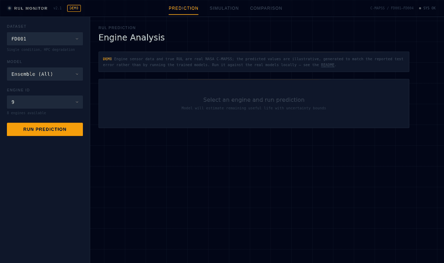

# Predictive Maintenance Digital Twin

**Aircraft engines don't fail out of nowhere — they leave clues.** This project reads those clues. It takes the raw sensor stream from a turbofan jet engine (temperatures, pressures, shaft speeds) and answers one question that matters enormously to anyone who operates machines for a living: *how many flights does this engine have left before it needs maintenance?*

That number is called **Remaining Useful Life (RUL)**, and predicting it accurately is the difference between fixing an engine right before it fails and grounding a fleet for parts that had thousands of cycles left in them.

**[▶ Open the live dashboard](https://maniic.github.io/predictive-maintenance-digital-twin/)** — pick a real test engine, get an RUL estimate with confidence bounds, and watch an engine degrade in a live simulation. No install needed.


[](https://maniic.github.io/predictive-maintenance-digital-twin/)

## Results

Predictions are measured in **cycles** (one cycle = one flight). Best model per dataset, on held-out test engines:

| Dataset | Best Model | RMSE (cycles) | MAE | Operating Conditions | Fault Modes |
|---------|------------|------|-----|---------------------|-------------|
| FD001 | LSTM | **13.48** | 9.86 | 1 | 1 (HPC) |
| FD002 | EnhancedLSTM-Asymmetric | **16.77** | 13.76 | 6 | 1 (HPC) |
| FD003 | TwoStage | **11.71** | 7.53 | 1 | 2 (HPC + Fan) |
| FD004 | EnhancedLSTM-Asymmetric | **14.75** | 9.33 | 6 | 2 (HPC + Fan) |

Put plainly: on the hardest dataset (FD004 — six operating regimes, two simultaneous fault modes), the model predicts an engine's remaining life to within about **15 flights** on average.

Every figure traces to a committed result file in [`models/`](models/README.md). No number here comes from anywhere else. **These metrics are computed over every sliding window of every test trajectory, not one prediction per engine as the standard C-MAPSS benchmark specifies — so they are not comparable to published leaderboard figures.** Why, and what it changes, is in [the architecture notes](docs/architecture.md#evaluation-protocol).

→ **[Full results: all nine models, all four datasets, and what the comparison actually shows](docs/results.md)**

## Reproduce these results

Three commands from a cold clone. The C-MAPSS data is committed, so there is nothing to download:

```bash
git clone https://github.com/maniic/predictive-maintenance-digital-twin.git
cd predictive-maintenance-digital-twin
pip install -e .
```

Train a model and predict on a real engine:

```bash
python scripts/train.py --quick          # small LSTM, FD001, ~2 min on CPU
```

That ends by predicting on a real test engine. To score any engine yourself:

```bash
python scripts/predict.py --dataset FD001 --engine 24
```

```
  FD001 engine 24
  186 cycles observed

  Predicted RUL   21.3 cycles
  95% interval    n/a (uncertainty is ensemble spread; only one model loaded)
  True RUL        20 cycles
  Error           +1.3 cycles
  Health score    17%
```

That is real output from a two-minute model — the exact figures move a little
between runs, since only the data split is seeded.

To reproduce a specific row of the table above:

```bash
python scripts/train.py --models twostage --datasets FD003     # the 11.71 result
python scripts/train.py --models all --datasets all            # everything, hours on CPU
```

Verify the data is the unmodified NASA distribution, and run the tests:

```bash
python scripts/fetch_data.py --verify
pip install -e ".[dev]" && pytest
```

Optional extras: `".[tracking]"` for MLflow, `".[explain]"` for SHAP.

## Why I built this

The idea came out of a conversation with a friend who works around aircraft. He mentioned, almost offhandedly, that a lot of engine parts get replaced on a fixed schedule whether they need it or not, because nobody wants to be the person who stretched a part past its limit. That struck me as a problem tailor-made for machine learning: engines are covered in sensors, degradation shows up in the data long before failure, and NASA publishes an entire benchmark dataset (C-MAPSS) of engines run from healthy to failure in simulation.

So I built the whole pipeline: data ingestion, seven deep learning architectures trained and compared honestly against each other, and a monitoring dashboard that makes the predictions understandable to someone who has never heard the words "recurrent network."

## What it does

1. **Ingests run-to-failure sensor data** from NASA's C-MAPSS turbofan dataset: 21 sensors per engine, 709 engines, four sub-datasets of increasing difficulty (multiple operating conditions, multiple simultaneous fault modes).
2. **Trains and evaluates 7 deep learning architectures** on the RUL prediction task: bidirectional LSTM, temporal CNN, Transformer, two Enhanced-LSTM variants with attention, a two-stage health-indicator model, and a weighted ensemble with uncertainty quantification. Two further variants were trained on FD001 only and appear on the dashboard's comparison view.
3. **Serves everything through an interactive dashboard** where you can pick a real test engine and get an RUL estimate with confidence bounds, play back a degradation simulation, and compare every model's accuracy across all four datasets.

## The dashboard

Three views, each answering a different question.

### Prediction — "How long does this engine have?"

Pick a dataset, a model, and a real test engine. The dashboard shows the predicted RUL against the true answer, a per-model breakdown, a health status bar, and the full prediction trajectory over the engine's history with an uncertainty band.


### Simulation — "What does failure look like as it happens?"

A digital-twin degradation simulation: configure the initial life, degradation rate, and fault mode, then watch the engine age cycle by cycle while its RUL and health score decline.


### Comparison — "Which model should you trust?"

Every model, every dataset, side by side: RMSE, MAE, and the asymmetric C-MAPSS score, which penalizes overestimating RUL more than underestimating it — because telling an operator an engine has more life than it does is the expensive mistake.


**On the hosted demo:** GitHub Pages serves a static export with no Python backend and no trained checkpoints. The engine data and ground-truth RUL are real C-MAPSS; the predictions are illustrative values calibrated to each dataset's reported test error. The page says so in a badge and an in-page banner. Run it locally against the real models with `npm run dev` — see [the dashboard README](web/README.md).

## How it works

```
 NASA C-MAPSS                Training pipeline                    Serving
──────────────────    ─────────────────────────────────    ──────────────────────
 21 sensors            sliding windows (30 cycles)          Next.js dashboard
 709 engines       →   min-max normalization            →   • local: live PyTorch
 run-to-failure        RUL capped at 125 (piecewise)          inference via Python
 4 sub-datasets        7 architectures, PyTorch Lightning     • hosted: static demo
                       optional MLflow tracking               on GitHub Pages
```

- **Sequence modeling**: each prediction sees the last 30 cycles of all sensors, so the models learn degradation *trends*, not just snapshots.
- **Piecewise RUL target**: early in life, an engine's sensors say nothing about its distant failure date, so the target is capped at 125 cycles — standard C-MAPSS practice that stops models from claiming precision the data does not contain.
- **Ensemble + uncertainty**: the ensemble averages LSTM, CNN, and Transformer predictions and reports their disagreement as an uncertainty estimate, shown as confidence bands in the dashboard.
- **The digital twin**: a forward model calibrated from real FD001 sensor statistics, generating plausible sensor streams for an engine that isn't in the dataset — so the trained models can be exercised on synthetic degradation at any rate or fault mode.

→ **[Architecture: the full pipeline, all seven models and how they differ, the ensemble's uncertainty, and the evaluation protocol](docs/architecture.md)**

## Models

| Model | Idea | Where it wins |
|-------|------|---------------|
| LSTM (bidirectional) | 2-layer BiLSTM, hidden 128, attention pooling | Best all-rounder; wins FD001 |
| Temporal CNN | Dilated conv blocks, receptive field doubling per layer | Fast, competitive baseline |
| Transformer | 4-layer encoder, 4 heads | Single-condition datasets; collapses on FD002 |
| EnhancedLSTM (weighted / asymmetric) | Attention + residuals, loss penalizing late predictions | Multi-condition datasets; wins FD002 and FD004 |
| Two-Stage | Health-state classifier → three specialized RUL heads | Multi-fault datasets; best result overall (FD003) |
| Ensemble | Inverse-validation-RMSE weighted average + spread | Most robust; powers the dashboard default |

## Limitations

Worth being straight about, because the boundaries matter more than the numbers:

- **C-MAPSS is simulated, not real flight data.** NASA generated it with a thermodynamic engine model plus injected noise and fault progression. Real sensor streams bring missing values, drift and recalibration, maintenance events mid-life, sensors that fail independently of the engine, and far fewer clean run-to-failure examples — most fleets never let an engine run to failure at all. Expect a substantial accuracy drop and a need for far more careful preprocessing.
- **The evaluation protocol is not the C-MAPSS benchmark.** Metrics are per sliding window, not one prediction per test engine. They compare architectures fairly against each other on this data; they are not leaderboard-comparable. [Details](docs/architecture.md#evaluation-protocol).
- **17 test engines are excluded.** Six in FD002 and eleven in FD004 have trajectories shorter than the 30-cycle window, so they produce no predictions. Short trajectories are the hardest cases, which makes the reported task marginally easier than the full test set.
- **Uncertainty is model disagreement, not calibration.** The band is the spread across three ensemble members — a useful signal that the models are unsure, not a statistically calibrated 95% interval. Three models is a small sample for a standard deviation.
- **The RUL cap at 125 is an assumption.** It encodes "you cannot tell how much life remains when an engine is healthy". It is standard practice and it improves results, but it means the models cannot distinguish a nearly-new engine from a middle-aged one.
- **No trained checkpoints are committed.** They are large binaries. Reproducing the exact published numbers means retraining, which takes hours on CPU.
- **The digital twin is a statistical interpolation**, calibrated from FD001 only — not a thermodynamic model, and representative of one operating condition.

## Project structure

```
├── src/                  # Python package
│   ├── data/             #   C-MAPSS loading, RUL computation, preprocessing, windowing
│   ├── models/           #   LSTM / CNN / Transformer / enhanced / two-stage / ensemble
│   ├── digital_twin/     #   Degradation simulator + RUL predictor (the serving path)
│   ├── evaluation/       #   Metrics and SHAP explainability
│   └── api/              #   JSON CLI the dashboard calls for live inference
├── scripts/              # train.py, predict.py, fetch_data.py, export_demo_data.py
├── config/config.yaml    # Data, preprocessing, and training configuration
├── models/               # Published training results (JSON) — see models/README.md
├── tests/                # 100 tests: windowing, leakage, metrics, end-to-end serving
├── docs/                 # Architecture, full results, dataset notes
├── web/                  # Next.js dashboard (prediction / simulation / comparison)
└── .github/workflows/    # CI (tests, lint, dashboard build) + Pages deploy
```

## Documentation

| Document | What's in it |
|---|---|
| [docs/architecture.md](docs/architecture.md) | The pipeline end to end, all seven architectures, the ensemble's uncertainty, the digital twin, and the evaluation protocol |
| [docs/results.md](docs/results.md) | Every model on every dataset, and what the comparison shows |
| [docs/data.md](docs/data.md) | C-MAPSS: what it is, why it's committed here, how to verify and re-fetch it |
| [models/README.md](models/README.md) | Which run produced which published number |
| [web/README.md](web/README.md) | Running the dashboard locally against real models |

## Acknowledgments

- NASA Prognostics Center of Excellence for the C-MAPSS dataset. See [docs/data.md](docs/data.md) for the citation and licensing.

## License

MIT — see [LICENSE](LICENSE). The C-MAPSS dataset in `data/raw/` is a work of the United States Government and is not covered by that license.
