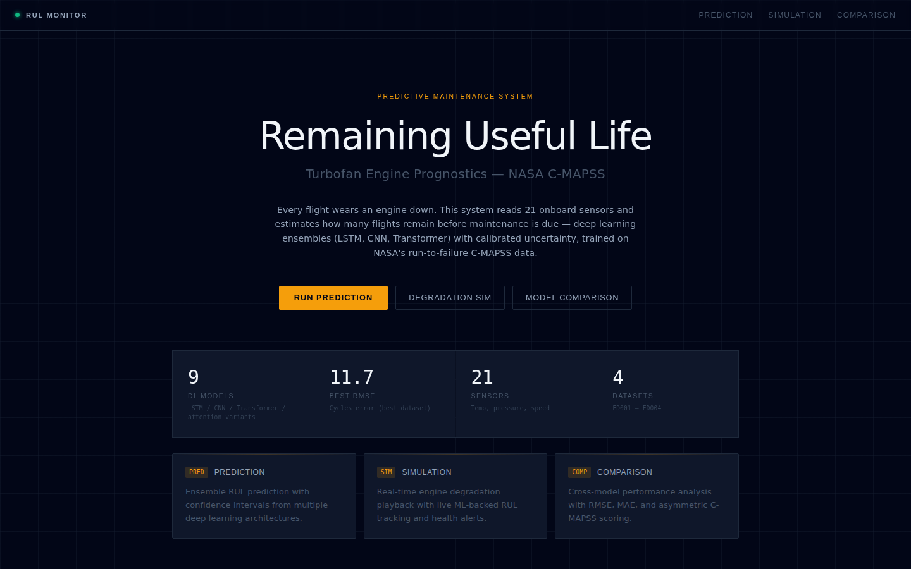
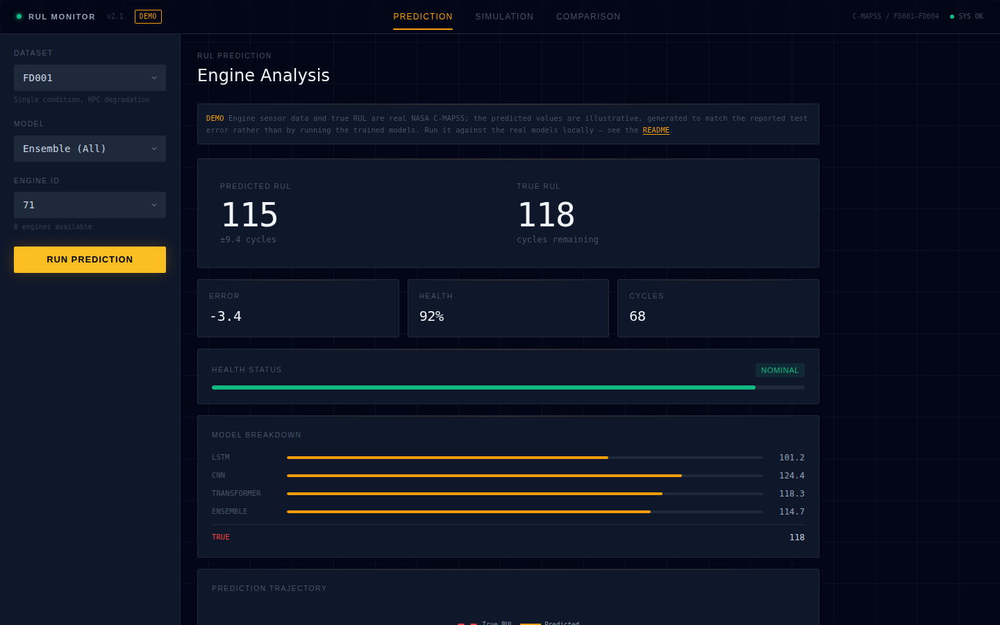
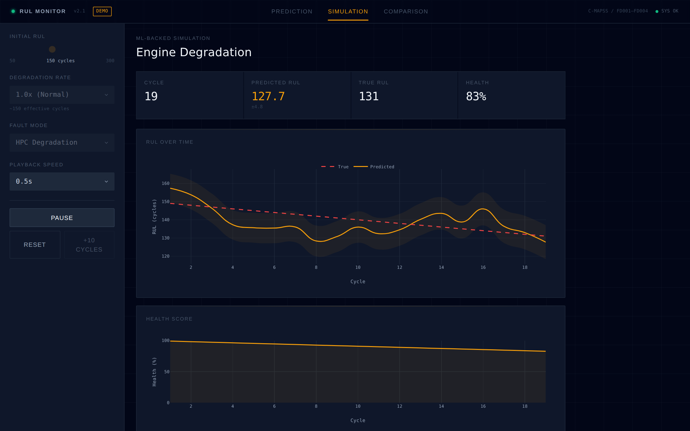
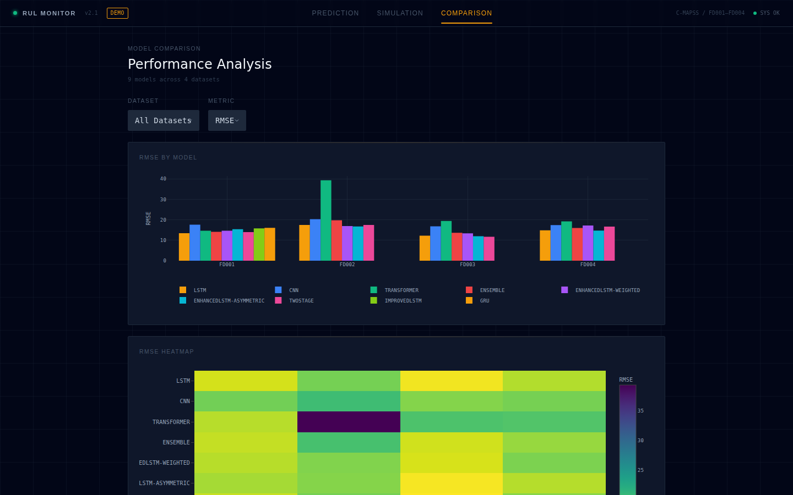

# Predictive Maintenance Digital Twin

**Aircraft engines don't fail out of nowhere — they leave clues.** This project reads those clues. It takes the raw sensor stream from a turbofan jet engine (temperatures, pressures, shaft speeds) and answers one question that matters enormously to anyone who operates machines for a living: *how many flights does this engine have left before it needs maintenance?*

That number is called **Remaining Useful Life (RUL)**, and predicting it accurately is the difference between fixing an engine right before it fails and grounding a fleet for parts that had thousands of cycles left in them.

**[▶ Open the live dashboard](https://maniic.github.io/predictive-maintenance-digital-twin/)** — run predictions on real engine data, watch an engine degrade in a live simulation, and compare model performance. No install needed.


[](https://maniic.github.io/predictive-maintenance-digital-twin/)

## Why I built this

The idea came out of a conversation with a friend who works around aircraft. He mentioned, almost offhandedly, that a lot of engine parts get replaced on a fixed schedule whether they need it or not, because nobody wants to be the person who stretched a part past its limit. That struck me as a problem tailor-made for machine learning: engines are covered in sensors, degradation shows up in the data long before failure, and NASA publishes an entire benchmark dataset (C-MAPSS) of engines run from healthy to failure in simulation.

So I built the whole pipeline: data ingestion, seven deep learning architectures trained and compared honestly against each other, and a monitoring dashboard that makes the predictions understandable to someone who has never heard the words "recurrent network."

## What it does

1. **Ingests run-to-failure sensor data** from NASA's C-MAPSS turbofan dataset: 21 sensors per engine, hundreds of engines, four sub-datasets of increasing difficulty (multiple operating conditions, multiple simultaneous fault modes).
2. **Trains and evaluates 7 deep learning architectures** on the RUL prediction task: bidirectional LSTM, temporal CNN, Transformer, two Enhanced-LSTM variants with attention, a two-stage health-indicator model, and a weighted ensemble with uncertainty quantification. Two further variants (attention-LSTM and GRU) were trained on FD001 only and appear on the dashboard's comparison view. Runs are tracked with MLflow when it is installed.
3. **Serves everything through an interactive dashboard** where you can pick a real test engine and get an RUL estimate with confidence bounds, play back a live degradation simulation, and compare every model's accuracy across all four datasets.

## Results

Predictions are measured in **cycles** (one cycle = one flight). Best model per dataset, evaluated on held-out test engines:

| Dataset | Best Model | RMSE (cycles) | MAE | Operating Conditions | Fault Modes |
|---------|------------|------|-----|---------------------|-------------|
| FD001 | LSTM | **13.48** | 9.86 | 1 | 1 (HPC) |
| FD002 | EnhancedLSTM-Asymmetric | **16.77** | 13.76 | 6 | 1 (HPC) |
| FD003 | TwoStage | **11.71** | 7.53 | 1 | 2 (HPC + Fan) |
| FD004 | EnhancedLSTM-Asymmetric | **14.75** | 9.33 | 6 | 2 (HPC + Fan) |

Put plainly: on the hardest dataset (FD004 — six operating regimes, two simultaneous fault modes), the model predicts an engine's remaining life to within about **15 flights** on average.

<details>
<summary>Full per-model results (all 4 datasets)</summary>

**FD001**

| Model | RMSE | MAE |
|-------|------|-----|
| LSTM | 13.48 | 9.86 |
| TwoStage | 14.01 | 10.17 |
| Ensemble | 14.14 | 10.81 |
| Transformer | 14.66 | 10.96 |
| EnhancedLSTM-Weighted | 14.65 | 11.00 |
| EnhancedLSTM-Asymmetric | 15.41 | 11.12 |
| CNN | 17.63 | 13.80 |

**FD002**

| Model | RMSE | MAE |
|-------|------|-----|
| EnhancedLSTM-Asymmetric | 16.77 | 13.76 |
| EnhancedLSTM-Weighted | 16.94 | 13.71 |
| LSTM | 17.49 | 14.01 |
| TwoStage | 17.50 | 13.48 |
| Ensemble | 19.80 | 17.02 |
| CNN | 20.29 | 15.83 |
| Transformer | 39.36 | 36.33 |

**FD003**

| Model | RMSE | MAE |
|-------|------|-----|
| TwoStage | 11.71 | 7.53 |
| EnhancedLSTM-Asymmetric | 12.00 | 8.17 |
| LSTM | 12.23 | 8.37 |
| EnhancedLSTM-Weighted | 13.38 | 8.86 |
| Ensemble | 13.66 | 10.13 |
| CNN | 16.82 | 12.05 |
| Transformer | 19.47 | 14.60 |

**FD004**

| Model | RMSE | MAE |
|-------|------|-----|
| EnhancedLSTM-Asymmetric | 14.75 | 9.33 |
| LSTM | 14.87 | 9.83 |
| Ensemble | 16.02 | 10.14 |
| TwoStage | 16.68 | 9.81 |
| EnhancedLSTM-Weighted | 17.19 | 12.96 |
| CNN | 17.45 | 11.23 |
| Transformer | 19.23 | 11.67 |

</details>

## The dashboard

Three views, each answering a different question.

### Prediction — "How long does this engine have?"

Pick a dataset, a model, and a real test engine. The dashboard shows the predicted RUL against the true answer, a per-model breakdown, a health status bar, and the full prediction trajectory over the engine's history with an uncertainty band.



### Simulation — "What does failure look like as it happens?"

A digital-twin degradation simulation: configure the initial life, degradation rate, and fault mode, then watch the engine age in real time while the model tracks its declining RUL and health score, raising warnings as it approaches failure.



### Comparison — "Which model should you trust?"

Every model, every dataset, side by side: RMSE, MAE, and the asymmetric C-MAPSS score (which penalizes overestimating RUL more than underestimating it, because telling an operator an engine has more life than it does is the expensive mistake).



## How it works

```
 NASA C-MAPSS                Training pipeline                    Serving
──────────────────    ─────────────────────────────────    ──────────────────────
 21 sensors            sliding windows (30 cycles)          Next.js dashboard
 700+ engines      →   min-max normalization            →   • local: live PyTorch
 run-to-failure        RUL capped at 125 (piecewise)          inference via Python
 4 sub-datasets        7 architectures, PyTorch Lightning     • hosted: static build
                       optional MLflow tracking               on GitHub Pages
```

- **Sequence modeling**: each prediction sees the last 30 cycles of all sensors, so the models learn degradation *trends*, not just snapshots.
- **Piecewise RUL target**: early in life, an engine's sensors say nothing about its distant failure date, so the target is capped at 125 cycles — the standard C-MAPSS practice that stops models from hallucinating precision they can't have.
- **Ensemble + uncertainty**: the ensemble averages LSTM, CNN, and Transformer predictions and reports their disagreement as an uncertainty estimate, shown as confidence bands in the dashboard.
- **Two deployment modes**: locally the dashboard calls the real PyTorch models through a Python bridge, once you have trained checkpoints. The hosted demo is a fully static build — real C-MAPSS engine data and ground-truth RUL, with illustrative predictions calibrated to the reported test error rather than live inference, since checkpoints are not committed. It is marked with a DEMO badge and an in-page banner, and deployed by GitHub Actions on every push to `main`.

## Models

| Model | Idea | Where it wins |
|-------|------|---------------|
| LSTM (bidirectional) | 2-layer BiLSTM, hidden 128 | Best all-rounder; wins FD001 |
| Temporal CNN | 4 dilated conv blocks | Fast, competitive baseline |
| Transformer | 4-layer encoder, 4 heads | Single-condition datasets |
| EnhancedLSTM (weighted / asymmetric) | Attention + residuals, asymmetric loss penalizing late predictions | Multi-condition datasets; wins FD002 and FD004 |
| Two-Stage | Autoencoder health indicator → RUL regression | Multi-fault datasets (FD003) |
| Ensemble | Weighted average + uncertainty | Most robust, powers the dashboard default |

## Quick start

### Run the training pipeline

```bash
git clone https://github.com/maniic/predictive-maintenance-digital-twin.git
cd predictive-maintenance-digital-twin
pip install -e .
```

The C-MAPSS data is committed, so there is nothing to download. Then:

```bash
python scripts/train.py --quick                    # ~2 min on CPU, ends with a prediction
python scripts/predict.py --dataset FD001 --engine 24
```

Everything else is flags on the same entry point:

```bash
python scripts/train.py --models lstm --datasets FD001
python scripts/train.py --models all --datasets all        # hours on CPU
python scripts/train.py --models enhanced-lstm-asymmetric twostage --datasets FD003
```

Training behavior (sequence length, normalization, RUL cap, epochs, early stopping) is configured in `config/config.yaml`. Optional extras: `pip install -e ".[tracking]"` for MLflow, `".[explain]"` for SHAP, `".[dev]"` for the test suite.

### Run the dashboard locally (live inference)

The dashboard's API routes call the Python models via subprocess, so activate the venv first:

```bash
source .venv/bin/activate
cd web
npm install
npm run dev        # http://localhost:3000
```

### Build the hosted demo (no Python needed)

```bash
cd web
npm run build:static      # static site in web/out/, demo data from scripts/export_demo_data.py
```

The GitHub Actions workflow (`.github/workflows/deploy-pages.yml`) runs this build and deploys it to GitHub Pages on every push to `main`.

## Project structure

```
├── src/                  # Python package: data ingestion, models, digital twin
│   ├── data/             #   C-MAPSS loading, RUL computation, windowing
│   ├── models/           #   LSTM / CNN / Transformer / two-stage / ensemble
│   ├── digital_twin/     #   Degradation simulator + RUL predictor
│   └── api/              #   CLI bridge the dashboard calls for live inference
├── scripts/              # train.py, predict.py, fetch_data.py, demo-data export
├── config/config.yaml    # Data, preprocessing, and training configuration
├── models/               # Training result logs (JSON)
├── web/                  # Next.js dashboard (prediction / simulation / comparison)
└── .github/workflows/    # CI: static build + GitHub Pages deploy
```

## The dataset

C-MAPSS (Commercial Modular Aero-Propulsion System Simulation) is NASA's benchmark for engine prognostics: simulated turbofan engines run from healthy operation to failure.

| Dataset | Train engines | Test engines | Operating conditions | Fault modes |
|---------|--------------|--------------|---------------------|-------------|
| FD001 | 100 | 100 | 1 | HPC degradation |
| FD002 | 260 | 259 | 6 | HPC degradation |
| FD003 | 100 | 100 | 1 | HPC + Fan degradation |
| FD004 | 249 | 248 | 6 | HPC + Fan degradation |

Each engine reports 21 sensors per cycle: temperatures, pressures, fan and core speeds, bypass ratio, bleed enthalpy, and coolant bleed measurements.

## Evaluation

- **RMSE / MAE** in cycles, on held-out test engines.
- **C-MAPSS score**: the competition's asymmetric metric. Predicting an engine will last *longer* than it does is penalized exponentially harder than the reverse, mirroring the real cost asymmetry of maintenance planning:

```
Score = Σ exp(-d/13) - 1   if d < 0  (predicted early — cheap mistake)
        Σ exp(d/10) - 1    if d ≥ 0  (predicted late — expensive mistake)
```

## Acknowledgments

- NASA Prognostics Center of Excellence for the C-MAPSS dataset.
