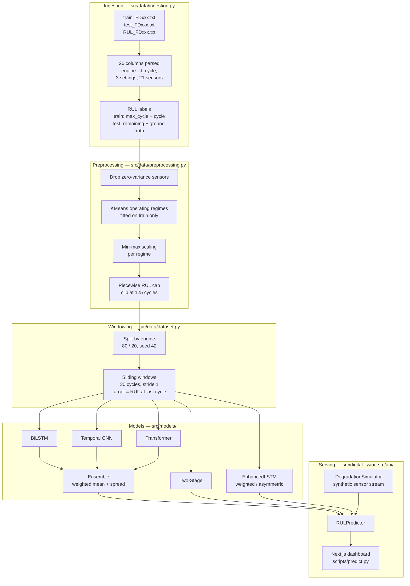

# Architecture

How a raw C-MAPSS sensor file becomes a remaining-useful-life number with an
uncertainty band, end to end.

- [Pipeline overview](#pipeline-overview)
- [Ingestion](#ingestion)
- [RUL targets](#rul-targets)
- [Preprocessing](#preprocessing)
- [Windowing](#windowing)
- [The seven architectures](#the-seven-architectures)
- [Ensemble and uncertainty](#ensemble-and-uncertainty)
- [The digital twin simulator](#the-digital-twin-simulator)
- [Evaluation protocol](#evaluation-protocol)
- [Serving](#serving)

## Pipeline overview

## Ingestion

`src/data/ingestion.py` parses the raw space-separated files into a frame with
`engine_id`, `cycle`, `setting_1..3` and `sensor_1..21`, sorted by engine and
cycle. The RUL file carries one integer per test engine, with engine ids
implicit in line order; the loader asserts that its length matches the number of
test engines, so a truncated file fails immediately rather than silently
misaligning every label.

## RUL targets

The two splits need different constructions:

**Training** trajectories run to failure, so remaining life at any cycle is
simply `max_cycle − cycle`, reaching zero at the final observation.

**Test** trajectories are truncated before failure, and `RUL_FDxxx.txt` gives
the true remaining life at the *last observed* cycle. Earlier cycles get
`(max_cycle − cycle) + RUL_at_end`.

Getting this backwards is a classic C-MAPSS mistake — it makes test targets look
like training targets and flatters the metrics. `tests/test_data/test_ingestion.py`
pins both constructions.

## Preprocessing

Four steps, in order, in `CMAPSSPreprocessor`:

**Zero-variance sensor removal.** The default `auto` strategy drops only sensors
with literally zero variance (sensor 1 is constant at 518.67 in FD001, for
example). Near-constant sensors are deliberately kept: their small variations
can still carry degradation signal.

**Operating-regime clustering.** FD002 and FD004 run engines across six flight
conditions, and the same sensor reading means different things in different
conditions. KMeans over the three operational settings recovers those regimes,
and the cluster assignment becomes a feature. The model is fitted on training
data and only *predicts* on test data. FD001 and FD003 have a single condition,
so `--regimes auto` normalizes them globally instead of clustering noise into
six meaningless groups.

**Normalization.** Min-max scaling, fitted per regime on training data only.
This is the one place test data could leak into training, so
`tests/test_data/test_preprocessing.py` checks it positively: a deliberately
shifted test set must produce values *outside* [0, 1], which can only happen if
the scaler is not refitting.

**Piecewise RUL cap.** Targets are clipped at 125 cycles. Early in an engine's
life the sensors genuinely do not indicate how far away failure is, so an
uncapped target asks the model to predict something the data does not contain.
Capping is standard C-MAPSS practice and it applies to train and test alike —
they must share a target definition or the reported error is meaningless.

## Windowing

Each sample is the last 30 cycles of every feature, with the target being RUL at
the **final** cycle of the window. Windows are built per engine and never span
two engines. With stride 1, an engine of *n* cycles yields *n − 29* windows.

Two consequences worth stating plainly:

- **Engines shorter than 30 cycles produce nothing.** Six test engines in FD002
  and eleven in FD004 are therefore excluded from evaluation entirely. Short
  trajectories are the hardest cases, so this makes the task slightly easier
  than the full test set would be. `scripts/train.py` prints the count.
- **The train/validation split is by engine, not by row.** Overlapping windows
  from one engine are near-duplicates; splitting rows would put nearly identical
  samples on both sides and produce an optimistic validation score.

## The seven architectures

All share the same input — `(batch, 30, n_features)` — and emit one RUL value
per window.

| Model | Structure | Idea |
|---|---|---|
| **LSTM** | 2-layer bidirectional LSTM, hidden 128, attention pooling | Reads the window in both directions and attends over timesteps rather than taking the last state. The strongest single model on FD001. |
| **Temporal CNN** | Stacked 1-D convolutions, dilation doubling per block (1, 2, 4) | Widens the receptive field geometrically instead of recurring, so it trains fast. Competitive baseline, never the winner. |
| **Transformer** | Sinusoidal positional encoding, 4-layer encoder, 4 heads, d_model 64 | Self-attention over the window. Works on single-condition data and collapses on FD002 (RMSE 39.4) — with six operating regimes and no recurrence, the positional signal is not enough. |
| **EnhancedLSTM (weighted)** | LSTM + attention + residual connections, weighted MSE | Errors on low-RUL windows are weighted up, plus a 30% surcharge on over-predictions, because a mistake near failure costs more than the same mistake at 120 cycles. |
| **EnhancedLSTM (asymmetric)** | Same body, exponential asymmetric loss | Trains directly against the shape of the C-MAPSS score: late predictions penalized `exp(d/10)`, early ones `exp(−d/13)`, blended with MSE for stability. Wins FD002 and FD004 — the two hardest datasets. |
| **Two-Stage** | Shared LSTM encoder → 3-way health classifier + three specialized regression heads | Classifies the window as healthy / degrading / critical, then blends three RUL heads by the class probabilities. Soft rather than hard routing, so it stays differentiable. Best single result in the project: 11.71 RMSE on FD003. |
| **Ensemble** | Weighted mean of LSTM, CNN and Transformer | See below. |

Two further variants — an attention-LSTM (`ImprovedLSTM`) and a GRU — were
trained on FD001 only and appear on the dashboard's comparison view. Neither beat
the plain LSTM, which is why they are not in the headline table.

## Ensemble and uncertainty

The ensemble takes a weighted mean of the three base models, with weights set to
inverse validation RMSE and normalized to sum to one — a model that validated
better contributes more, without any extra fitting.

Uncertainty is the **weighted standard deviation across members**, computed as
`E[X²] − E[X]²` and clamped at zero for numerical safety. This is model
disagreement, not a calibrated predictive interval: when the three architectures
converge on an answer the band is narrow, and when they diverge it is wide. The
dashboard shows ±1.96σ as a confidence band, which is a useful visual signal of
"the models are unsure here" rather than a statistically calibrated 95% interval.

The honest limitation: three models is a small sample for a standard deviation,
and a single loaded model reports zero spread. `scripts/predict.py` says so
explicitly rather than printing a degenerate interval.

## The digital twin simulator

`src/digital_twin/simulator.py` is a **forward** model, where the networks are
inverse models. They map sensors → RUL; the simulator maps a health state →
plausible sensor readings.

It carries sensor profiles calibrated from real FD001 data — for each sensor, a
baseline, a spread, the observed healthy range, the observed degraded range, and
whether it rises or falls as the engine wears. A health index runs from 1.0 to
0.0 along a piecewise-linear curve that mirrors the RUL-cap assumption: roughly
flat for the first 40% of life, then accelerating. Each `step()` interpolates
every sensor between its healthy and degraded ranges according to current health,
adds noise, and emits one cycle's readings.

That matters because it lets the trained models be exercised on an engine that
does not exist in the dataset. Feed 30 simulated cycles into `RULPredictor` and
you get a real prediction on synthetic input — which is what makes the dashboard
a *digital twin* rather than a dataset browser. It also makes fault modes and
degradation rates adjustable, which C-MAPSS itself does not offer.

Two caveats: the profiles come from FD001 only, so the simulator represents one
operating condition; and it is a statistical interpolation between observed
states, not a thermodynamic model of a turbofan.

**In the hosted demo this simulator does not run at all** — GitHub Pages has no
Python. The deployed page computes an equivalent curve in JavaScript and says so
in a banner.

## Evaluation protocol

**Read this before comparing these numbers to a paper.**

Metrics are computed over **every sliding window of every test trajectory**, not
one prediction per engine. FD001's 100 test engines yield 10,196 windows; FD004's
248 yield 34,081.

The standard C-MAPSS benchmark scores a *single* prediction per engine — the
final window, against `RUL_FDxxx.txt`. The two protocols are not comparable.
Windows early in a trajectory sit in the region where the target is pinned at the
125-cycle cap and are close to trivial, so averaging over all of them gives a
lower RMSE than the benchmark protocol would.

The numbers in this repository are internally consistent, computed identically
across every model, and therefore valid for the comparison they are used for:
*which architecture does better on this data*. They are not leaderboard figures.

Three metrics are reported:

- **RMSE** in cycles — punishes large errors, the usual headline.
- **MAE** in cycles — the average miss, easier to reason about.
- **C-MAPSS score** — the PHM08 competition's asymmetric penalty:
  `exp(d/10) − 1` when `d = predicted − true ≥ 0` (late, expensive) and
  `exp(−d/13) − 1` when `d < 0` (early, cheap). Telling an operator an engine
  has more life than it does is the mistake that grounds aircraft.

The argument order of `cmapss_score(y_pred, y_true)` matters: reversing it
inverts the asymmetry and makes over-optimistic models look good. Two historical
runs did exactly that, so their scores are withheld — see
[models/README.md](../models/README.md) — and
`tests/test_evaluation/test_metrics.py` now guards the order.

## Serving

`src/digital_twin/predictor.py` loads a fitted preprocessor and every available
checkpoint for a dataset, assembles them into an ensemble and exposes three entry
points: a raw preprocessed array, a DataFrame of raw sensor rows, or a list of
reading dicts from the simulator.

Everything above it is a thin wrapper:

- `scripts/predict.py` — command line.
- `src/api/predict.py` — JSON-over-stdout CLI.
- `web/app/api/*/route.js` — Next.js routes that shell out to it through
  `web/lib/python.js`.

The hosted GitHub Pages build has none of this: it is a static export over
precomputed payloads. Real C-MAPSS engine data and ground truth, illustrative
predictions, clearly badged.
